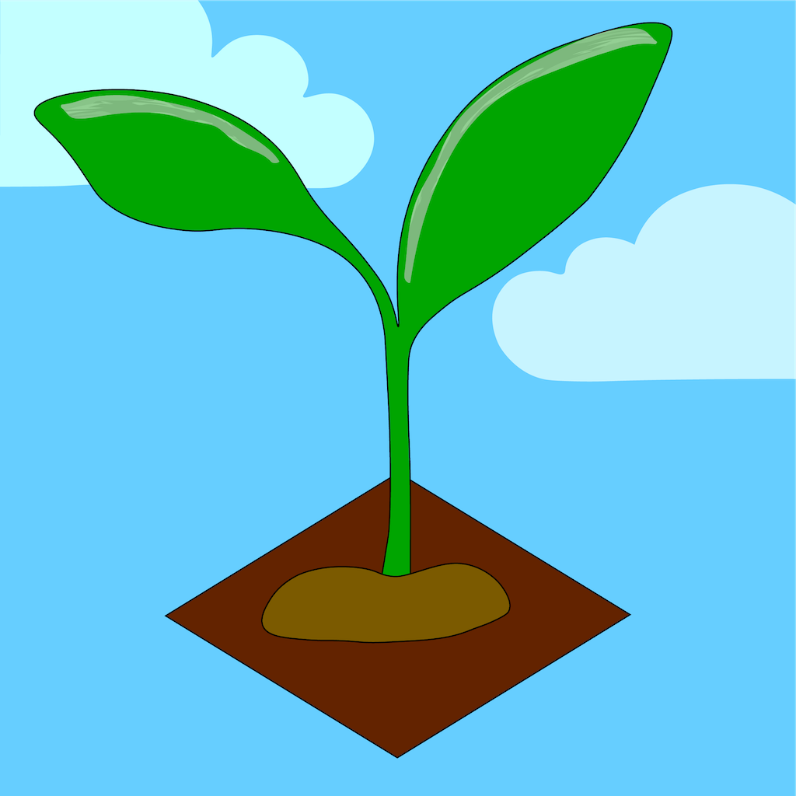
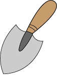

# HABIT GARDEN PROJECT
--------------

## What did we build?
* A Garden-themed Habit App to help people "plant" and "nuture" their good habits.
* We built this phone app for people interested in building better habits and self-improvement.
* App was built using SwiftUI and Xcode.

## UNDERSTANDING THE CODE
--------------

### Models
* Habit Data Class
    + Our Habit data class holds the attributes each habit needs such as name, plant, start & end date, frequency, etc.
* Plant Class
    + We created a Plant class that is mainly used to associate a plant's name and image stage together. This is helpful for keeping track of plant image growth for each habit.
* HabitStore
    + This class's function is for the saving and loading of our habit list data into a url. So whenever we close out of the app, our data is saved for the next load.
* QuoteManager
    + TBD

### Views
* ContentView
    + This view is the main homepage of the Habit Garden App. Displayed on the page is a 3x3 garden plot where habits can be grown and created. There are also tutorial and reset garden buttons which can help the user understand and/or reset the app.
* ImageSlideShow
    + This custom view displays the tutorial for our app's functionality. It automatically scrolls at a readable pace, but also has arrows to allow the user to understand the instructions at their own pace.
* AddView
    + This view is opened when a user clicks on a trowel to create a new habit. This view will allow the users to insert their habit's details such as frequency, name, plant choice, end date, and importance.
* DetailsView
    + The details view is accessed when a user click's on an existing habit's plant image. This view shows the details of a habit such as the log of checked-in dates, importance, plant image, etc.
* EditView
    + This view is accessed through the 'Edit' button in Details View. When accessed, EditView lets the user edit their habit's name, importance, and plant choice.
* ButtonView
    + This view is mainly used to display our custom plant images as clickable buttons. This view handles all the habit button interactions such as a normal tap (-> detail view) or a long-press (checking-off a habit).
* EmptyView
    + This view displays the trowel/shovel when there is not an existing habit in the garden slot. When clicked upon, this empty view will signal addview to start the creation of a habit.
* QuotesView
    + TBD

## Custom Assets
--------------
* all plants were made in illustrator by Curran and Francesca
--------------

## CREDITS
--------------
* made by Curran Middleton, Matthew Mukai, Michael Nguyen, Francesca Brown
* made for people interested in building better habits and self-improvement

